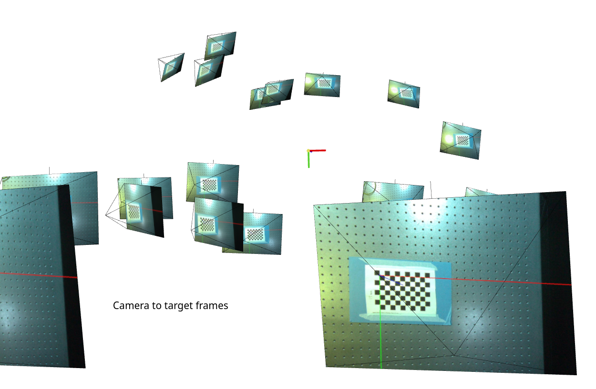
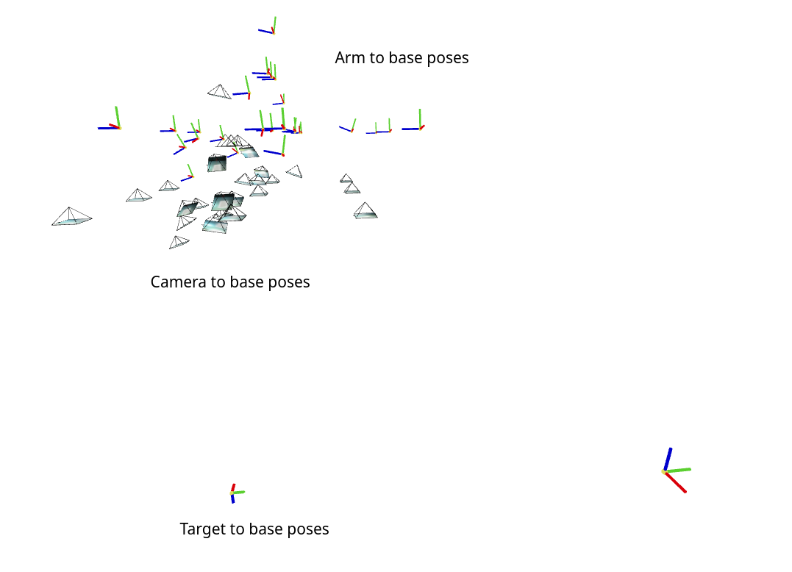

# YACHT: Yet Another Camera Hand calibration Tool
- Input data:
  - Arm poses
  - Camera images

- Output data:
  - Camera to arm end effector pose
  - Camera intrinsics
  - Target to arm base pose

## Running the script
- ROS not required
- Install dependencies:
  ```
  pip install -r requirements.txt
  ```

- Edit `config.yaml`:
  - Set `data-folder` path
  - Set chessboard target size

- Input data format:
  - `your_data_folder/images` — camera to arm calibration images named like `0001.png` (order matters)
  - `your_data_folder/arm_poses.npy` — [N, 4, 4] numpy array of poses
  - 
- Run:
  ```
  python yacht.py
  ```
- Loading output data:
```
with h5py.File("your_data_folder/result.h5", "r") as f:
    cam_to_arm_pose = f["cam_to_arm_pose"][:] # [4, 4] pose matrix
    camera_matrix = f["camera_matrix"][:] # [3, 3] camera matrix
    distortion_coeffs = f["distortion_coefficients"][:] # vector sized 5
    target_to_base_pose = f["target_to_base_pose"][:] # [4, 4] pose matrix
```

## Output & Checks
- Calibration RMS error should be low — otherwise rerecord the data
  
- Validate cam-to-arm pose and error — rerecord the data/check the frames if it's high
  
- With `visualize-2D`:
  → your_data_folder/visualization/ contains calibration target frame reprojected into images

- With `visualize-3D`:
  - First view — camera poses w.r.t. target
  

  - Second view — camera, arm, target poses in global frame. Target frames (frames in front of cameras) should cluster tightly. If spread out — error is high, add more diverse data
  

## Example dataset
Located in `example_dataset` folder

## Author's note
Made by [Nikolai Goncharov](https://www.linkedin.com/in/nikolai-goncharov-2931a31a5/).


