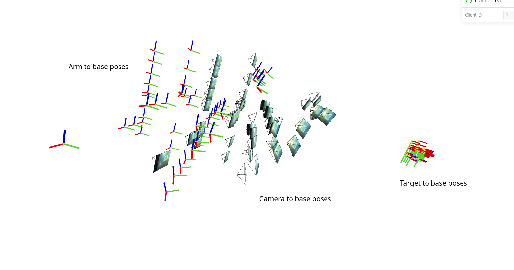

# YACHT: Yet Another Camera Hand calibration Tool

## Running the script
- ROS not required
- Install dependencies:
  ```
  pip install -r requirements.txt
  ```

- Edit `config.yaml`:
  - Set `data-folder` path
  - Set chessboard target size

- Prepare data:
  - `your_data_folder/images` — camera to arm calibration images named like `0001.png` (order matters)
  - `your_data_folder/arm_poses.npy` — [N, 4, 4] numpy array of poses
- Run:
  ```
  python yacht.py
  ```
- To load your result: `np.load("your_data_folder/result.npy")`

## Output & Checks
- Calibration RMS error should be low — otherwise rerecord the data
  
- Validate cam-to-arm pose and error — rerecord the data/check the frames if it's high
  
- With `visualize-2D`:
  → your_data_folder/visualization/ contains calibration target frame reprojected into images

- With `visualize-3D`:
  - First view — camera poses w.r.t. target
  

  - Second view — camera, arm, target poses in global frame. Target frames (frames in front of cameras) should cluster tightly. If spread out — error is high, add more diverse data
  

## Example dataset
Located in `example_dataset` folder

## Author's note
Made by [Nikolai Goncharov](https://www.linkedin.com/in/nikolai-goncharov-2931a31a5/).


